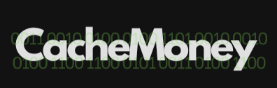
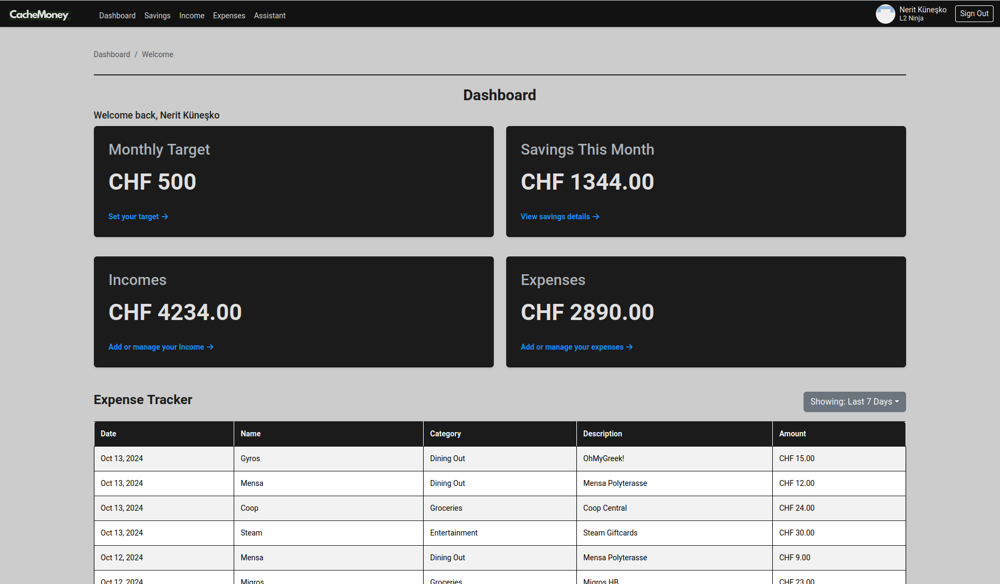
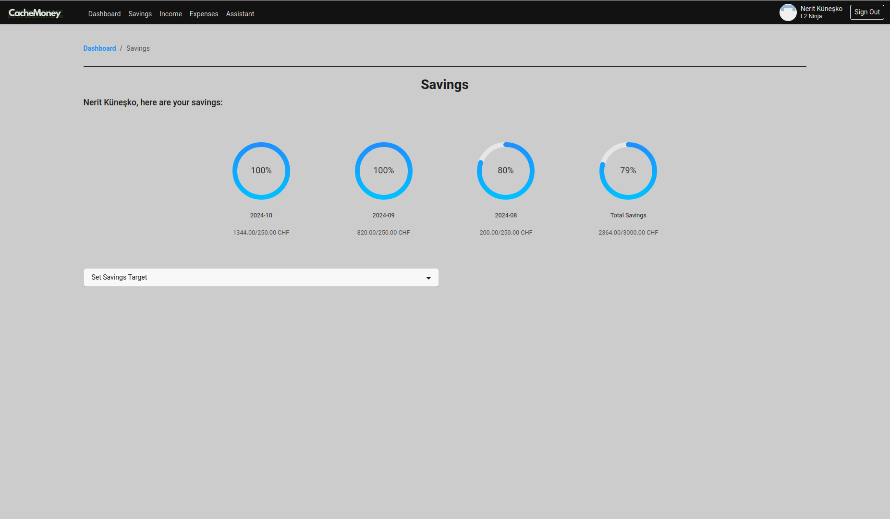
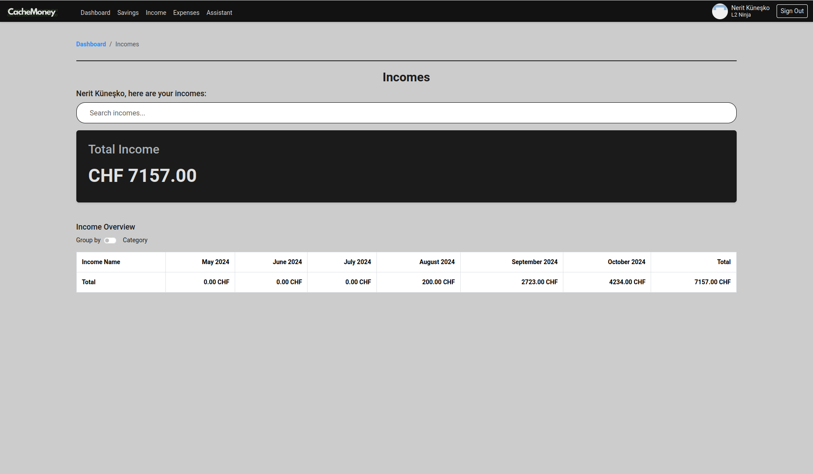
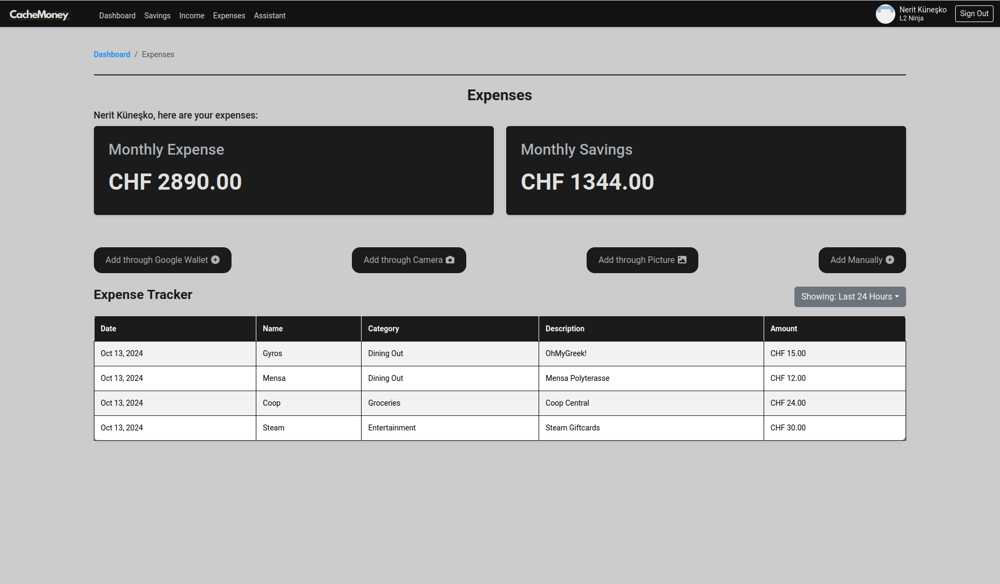
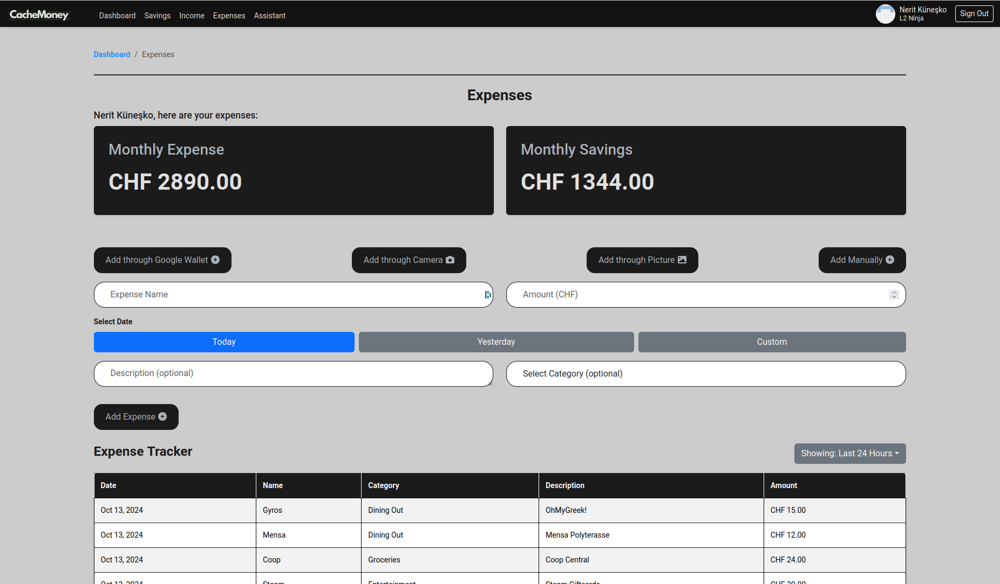
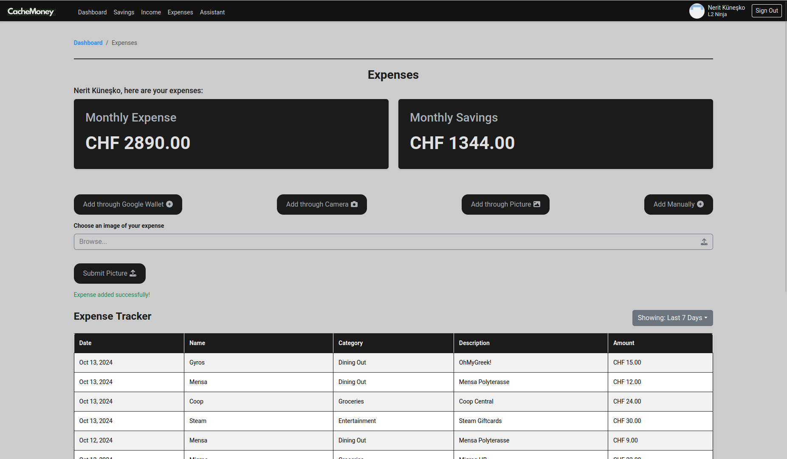
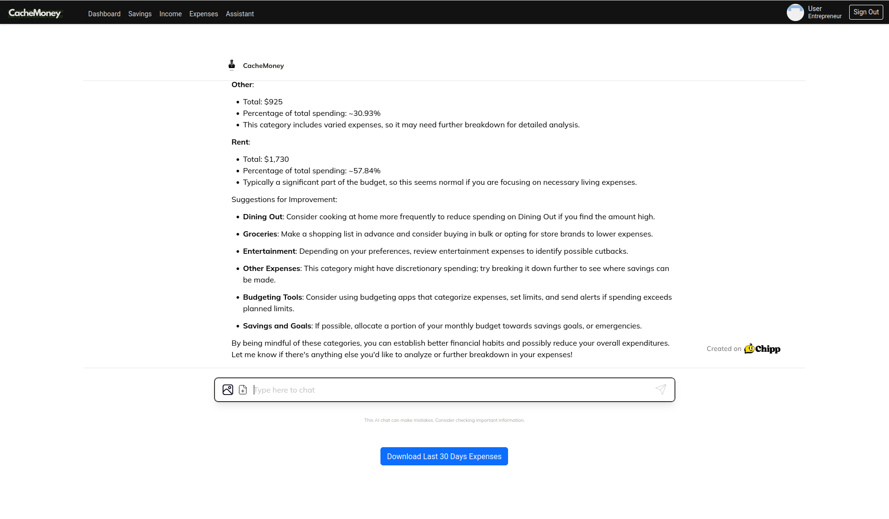

# CacheMoney: Gamified Budgeting App

## Overview

You thought you were doing alright. You thought you were on top of your finances this month. You thought you were fiscally responsible. But then rent is due, your Nebenkosten are shockingly high, you splurged on the Street option at the Polymensa, and you treated yourself to one too many sweet little indulgences (hey, you deserved them!). And let’s not even get started on the abolition of the free print quota for ETH printers (truly dystopian).

But now, life is CacheMoney. CacheMoney allows you to create a budget and track all of your transactions, effortlessly and rewardingly, all in one app. When you’re saving this much money and having this much fun, the only eviction you have to worry about is your cache eviction.

## Features
- **Budget Creation**: Set monthly savings targets and track your income and expenses in real time.
- **Expense Tracker**: Log and categorize your transactions to maintain a clear overview of your finances.
- **Savings Progress**: Track how well you're doing on your savings goals each month.
- **Personal Assistant**: A powerful chatbot assistant, powered by Chipp.ai, helps guide you through your financial decisions and keeps your budget on track.
- **Invoice and Bill Detection**: Automatically detect and categorize bills or receipts using Mistral AI’s new PixTral model, streamlining your expense management process.
- **Frontend**: Developed using **React** for smooth user interaction and dynamic interface updates.
- **Backend**: Powered by **Flask**, handling API calls, expense uploads, and interaction with the database.
- **Authentication & Database**: Managed using **Firebase**, ensuring a secure and scalable solution.
- **Payment Integration**: Submit expenses through **Google Wallet** or potentially via your banking app (future development).

## Example Screenshots

### Dashboard

The dashboard displays your monthly target, savings, income, and expenses in a clean, easy-to-understand layout.

### Savings Page

The savings page helps you track your savings progress against your set goals for each month.

### Income Page

The income page allows users to track their total income and categorize it by different sources.

### Expenses Page

The expense tracker displays your transactions, categorized by date, amount, and description.

### Manual Expense Entry

Users can manually input expenses if they're not automatically detected.

### Photo-Based Expense Entry

Users can submit expenses by uploading pictures of bills or receipts, which are automatically processed.

### Assistant

A powerful personal assistant powered by Chipp.ai that guides users through managing their finances and budgeting.

## Future Improvements
- **Enhanced Assistant Features**: More assistant functionalities are planned, such as personalized financial advice based on spending habits and goals.
- **Payment Integrations**: Integration with more payment platforms like banking apps for even more streamlined expense tracking.
- **Gamification Features**: Introducing reward systems and badges for hitting savings goals or tracking streaks.

## Technology Stack
- **Frontend**: React
- **Backend**: Flask
- **Database & Auth**: Firebase
- **Assistant**: Powered by Chipp.ai (LLM-based personal assistant)
- **Image Processing**: Mistral AI's PixTral model for invoice and bill recognition

## Hackathon
This project was developed during the **VIS Hackathon 2024** at ETH Zurich, which focused on web development. We were tasked with building innovative solutions over a weekend, and CacheMoney was born to solve budgeting challenges in a fun and engaging way.
